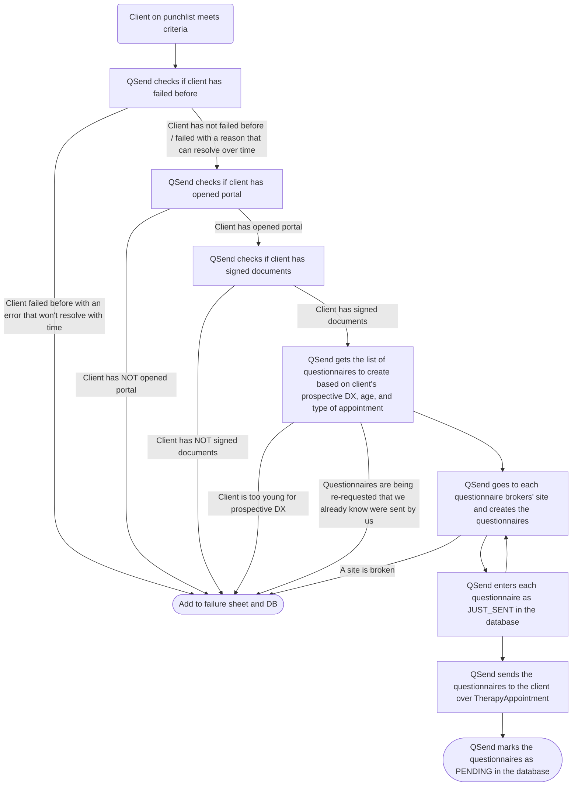

import { LinkCard } from "@astrojs/starlight/components";

<LinkCard
  title="Questionnaires on GitHub"
  href="https://github.com/driftwoodeval/questionnaires"
/>

## QSend

QSend is the first half of questionnaires. It runs [locally](/glossary#running-locally) and must be monitored by a person, who will step in if there are any issues. It creates questionnaire links on QGlobal, MHS, and WPS the same way a person does, but can move much faster than a person can.

QSend consults the [prioritization sheet](/documents/prioritization-sheet) to determine who to send questionnaires to, and which questionnaires to send. For QSend to run a client, they must have:

- A name
- A client ID
- A `For` column for prospective diagnosis
- Either:
  - `DA Qs Needed` checked and `DA Qs Sent` NOT checked
  - `EVAL Qs Needed` checked and `EVAL Qs Sent` NOT checked
  - `DA Qs Needed` and `EVAL Qs Needed` checked, `DA Qs Sent` and `EVAL Qs Sent` NOT checked

When QSend runs a client, it first checks the [database](/glossary#database) to see if the client has already failed before. If the client has failed before for a reason that can resolve over time, like being too young for the prospective diagnosis, having not opened the patient portal, or having not signed the documents, QSend will continue. If the client has failed for any other reason, QSend will re-add them to the [failures sheet](/documents/failures-sheet) and database.

QSend goes to TherapyAppointment and searches for the client's ID. It then checks if the client has opened the patient portal, made an account, and signed the consent forms. If they haven't, it adds them to the failures sheet and database, to be texted reminders by [QReceive](/programs/questionnaires#qreceive). If they have, QSend uses the data from TherapyAppointment and prioritization sheet to determine which questionnaires to create.

If the client is too young, the information from the prioritization sheet is malformed, or the client would be be re-assigned questionnaires we already sent, QSend adds them to the failures sheet and database. If there are no issues with the questionnaires to create, QSend begins going to the questionnaire brokers' sites and creating questionnaires. If all goes well, QSend navigates back to the client's TherapyAppointment page and messages them with all of the links to their questionnaires. It also creates entries in the database that can be seen in [Winnonah](/programs/winnonah), and marks `DA Qs Sent` or/and `EVAL Qs Sent` as appropriate.

### Flowchart

## QReceive

QReceive is the second half of questionnaires. It runs automatically every day at 1 pm on a server without human supervision. It checks on questionnaires' completion status, clients' account creation and consent documents, and texts clients reminders.
